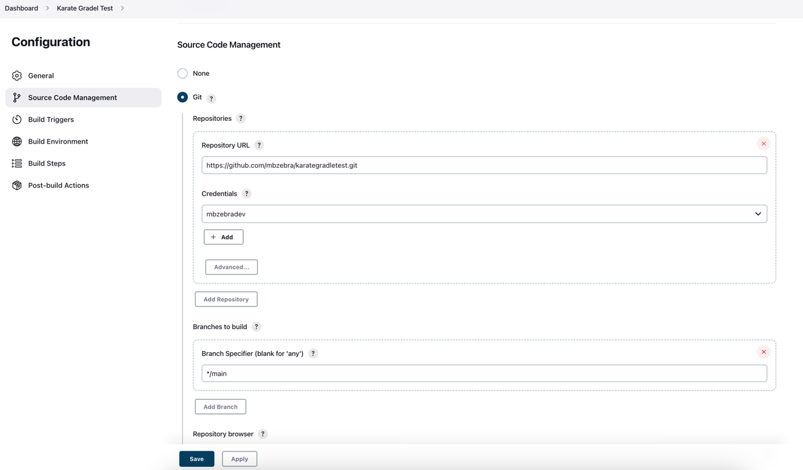
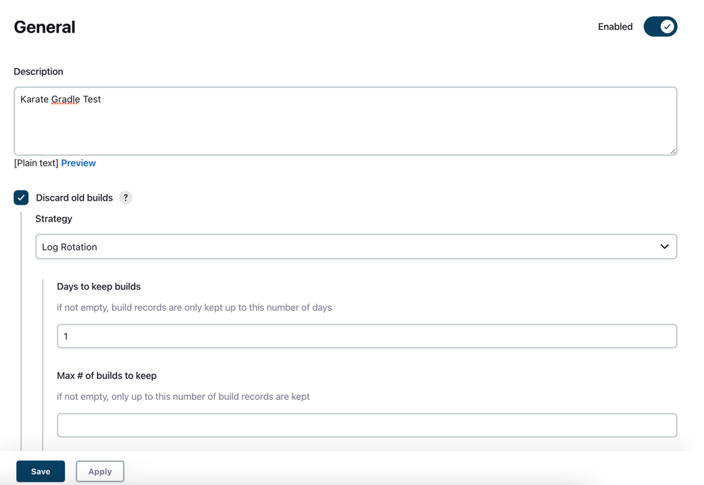
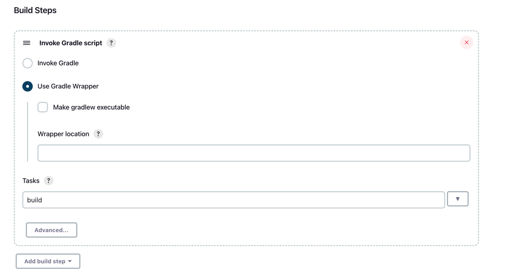

# Road to Continuous Build, Testing and Integration

## Karate - Gradle - Jenkins

| Tools                                                                   | Description |
|-------------------------------------------------------------------------| ----------- |
| [Karate](https://github.com/karatelabs/karate)  |Quality Automation System |
| [Gradle](https://gradle.org/)                                | Build Tool  |
| [Jenkins](https://www.jenkins.io/)           |Continuous Integration System |


Build Gradle

```groovy
buildscript {

    ext {
        karateVersion = '1.2.0'
    }

    repositories {
        mavenCentral()
    }
    dependencies {
        classpath("com.intuit.karate:karate-junit5:1.2.0")
        classpath("com.intuit.karate:karate-core:1.2.0")
        classpath("com.intuit.karate:karate-apache:0.9.6")
        classpath("org.junit.jupiter:junit-jupiter-api:5.9.0")
    }
}

plugins {
    id 'java'
}
repositories {
    mavenCentral()
}
sourceSets {
    test {
        resources {
            srcDir file('src/test/java')
            exclude '**/*.java'
        }
    }
}
dependencies {
    implementation 'com.intuit.karate:karate-junit5:1.2.0'
    implementation 'com.intuit.karate:karate-mock-http:0.4.3.1'
    implementation 'com.intuit.karate:karate-core:1.2.0'
    implementation 'org.junit.jupiter:junit-jupiter-api:5.7.2'
    implementation 'org.junit.jupiter:junit-jupiter-engine:5.7.2'
}
test {
    useJUnitPlatform()
    systemProperty "karate.options", System.properties.getProperty("karate.options")
    systemProperty "karate.env", System.properties.getProperty("karate.env")
    outputs.upToDateWhen { false }
}
task karateDebug(type: JavaExec) {
    classpath = sourceSets.test.runtimeClasspath
    main = 'com.intuit.karate.Main'
}
```


Karate Feature 

```gherkin
Feature: Example Test Feature

  Scenario Outline: Go to Yahoo, perform search for news
    * configure driver = <config>
    Given driver 'http://www.yahoo.com'
    Then waitFor('{label}Search query')

    Examples:
    | config |
    | {type: 'chromedriver', executable: '/usr/local/bin/chromedriver' , webDriverSession: { desiredCapabilities: { browserName: 'chrome' , "goog:chromeOptions": { args: [ '--headless', 'window-size=1280,720' ] }  } } } |
    | {type: 'geckodriver', executable: '/usr/local/bin/geckodriver', webDriverSession: { "capabilities": { "alwaysMatch": { "moz:firefoxOptions": { args: ["-headless"] } } } } }|

```

Jenkins Integration








